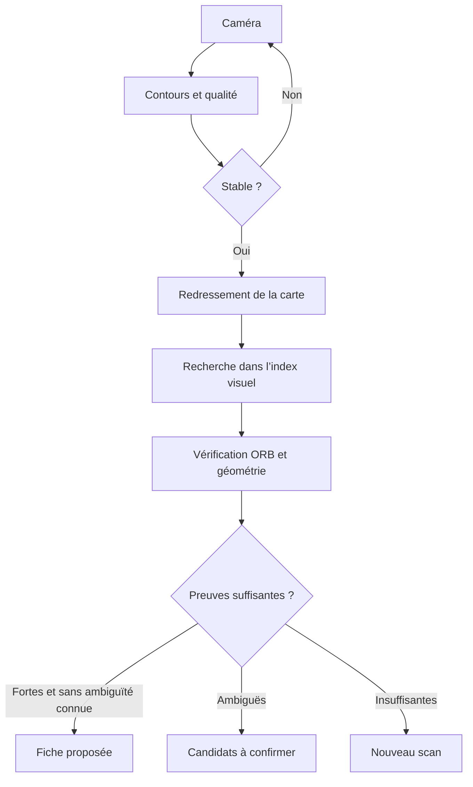

# Scanner visuel V5 — version TEST

Lien permanent : https://seuitsei.github.io/tcg-portfolio/test-localisation.html

La page stable `index.html` reste inchangée. Point de restauration : branche
`restore/pre-visual-scanner-2026-10-07`, commit `baa28493e7c6d396686a5d81b820ddaacac8856e`.
Empreinte Git du fichier stable : `e92df4c75e06d17885b4a8455344e859f2e19d27`.

## Utilisation

1. Ouvrir le lien TEST dans Chrome Android ou Safari récent, puis autoriser la caméra.
2. Choisir la langue imprimée sur la carte : FR ou EN. Le catalogue se prépare au premier lancement.
3. Montrer toute la carte, plutôt droite, sur un fond uni contrasté, sans reflet direct.
4. Le contour détecté passe du rouge à l’orange puis au vert. Après stabilisation, l’analyse se déclenche seule.
5. Une correspondance forte ouvre la fiche ; sinon, comparer les candidats. L’ajout au portfolio reste un geste explicite.

Une photo peut également être importée. Le bouton « Analyser maintenant » est un secours ; il n’est pas nécessaire au parcours automatique. Aucun petit cadre OCR à déplacer.

Le menu « Catalogue visuel » permet de préparer les références détaillées d’une extension pour les prochains scans sans téléchargement d’images. Une connexion est nécessaire au premier chargement de l’application et pour les références encore absentes du cache. Le fonctionnement hors connexion après fermeture complète/rechargement de la page n’est pas garanti : aucun service worker ne prend le contrôle de la page stable.

## Ce qui change

- Reconnaissance de l’image complète et de l’illustration, sans Tesseract dans le chemin de scan TEST.
- Détection de quatre coins, correction de perspective et normalisation.
- Contrôle du mouvement, du flou, de la luminosité et des surfaces surexposées.
- Index visuel préconstruit pour les cartes physiques FR/EN dont une image était disponible. Les cartes Pocket numériques sont exclues de cet index.
- Vérification géométrique des meilleurs candidats, cache IndexedDB et traitement dans un Web Worker.
- Conservation du stockage `tcgCards` existant ; pas d’effacement, de migration destructive ni d’ajout automatique.
- Arrêt des pistes caméra en quittant le scanner, en passant l’application en arrière-plan ou en fermant la caméra. Ouverture indépendante du moteur visuel.
- Diagnostic copiable sans photo : durée, candidats et mesures techniques.

## Architecture retenue

L’index contient deux grilles RGB normalisées de 6 × 6 : carte entière et zone d’illustration, soit 216 octets par référence. Soustraction des moyennes par canal et normalisation du contraste limitent les effets d’exposition/couleur. Ce signal sert à retrouver une liste courte ; il ne constitue pas une preuve d’identité.

La vérification utilise jusqu’à 350 points ORB par image, des correspondances de descripteurs binaires et une homographie RANSAC. Le nombre de points concordants, leur répartition spatiale, la distance visuelle et l’écart au deuxième candidat déterminent la décision. La recherche prend aussi en compte une orientation retournée à 180°.

L’analyse légère du flux travaille sur une image réduite, avec au moins 200 ms entre deux traitements terminés et une seule frame en cours. Le déclenchement demande environ 850 ms de stabilité et au moins quatre transitions stables. L’analyse complète travaille sur une capture de meilleure résolution. OpenCV tourne dans un Worker : aucune dépendance au WebGPU ou à une API payante.

Pour une nouvelle référence, seules les images des candidats présélectionnés sont téléchargées (trois en parallèle), puis leurs caractéristiques sont conservées dans IndexedDB. Les trois cartes demandées disposent de références détaillées préconstruites. Les photos de l’utilisateur ne sont jamais téléversées.

Les seuils sont **provisoires**, vérifiés sur des transformations synthétiques. Le score interne n’est **pas une probabilité calibrée** ; l’interface ne prétend donc pas donner « 95 % de certitude ». Une référence détaillée indisponible, un jumeau nom/numéro ou une référence d’une autre langue empêchent la sélection forte.

## Cas Dracaufeu / Charizard

TCGdex emploie `cel25cc-CC002` pour la Collection Classique, mais le numéro imprimé de Dracaufeu reste `4`. Il serait incorrect d’afficher `CC002` comme son numéro imprimé ou de confondre cette carte avec `cel25-4` (Palkia).

Un rapprochement explicite des 25 cartes classiques avec les références historiques Pokémon TCG API complète les images manquantes. Leur origine est documentée dans les données et le script de construction. Pour le français, l’image de référence de ces cartes est anglaise ; l’interface le signale et demande confirmation. Un logo 25e anniversaire n’est pas interprété par un détecteur spécialisé dans cette version : l’ORB aide à comparer les détails, mais les rééditions proches restent à confirmer.

`021/072` et `004/102` deviennent `21/72` et `4/102` dans la recherche manuelle. Les préfixes et formats comme `OP05-119` sont préservés. La référence ne sert jamais d’identifiant universel. La reconnaissance One Piece elle-même n’est pas encore implémentée.

## Validation

Résultats détaillés : [benchmark](../tests/benchmark-results.json) et [parcours navigateur](../tests/browser-results.json).

Le benchmark utilise 45 cartes différentes, sélectionnées de manière déterministe dans l’index français complet, dont Kyogre 21/72, Zamazenta 102/185 et Dracaufeu original / Évolutions / Célébrations. Trois situations par carte : perspective seule, perspective avec flou et changement de couleur, puis reflet artificiel. Soit 135 captures synthétiques.

| Situation | Cartes | Détectées | Bon premier candidat | Bonne carte dans les trois premières | Faux résultat « fort » |
|---|---:|---:|---:|---:|---:|
| Perspective | 45 | 44 | 44 | 44 | 0 |
| Flou et couleur | 45 | 44 | 44 | 44 | 0 |
| Reflet artificiel | 45 | 44 | 42 | 44 | 0 |

Ces résultats ne mesurent **pas** la précision sur de vraies cartes photographiées. Les images de test dérivent des images de référence ; les plastiques, textures holographiques, mains et capteurs réels ne sont pas représentés fidèlement. Les durées de la machine de test ne prédisent pas celles d’un smartphone.

Le parcours Chromium à une largeur mobile de 390 px vérifie : caméra avant disponibilité du moteur, capture automatique sans bouton photo, reconnaissance, import, conservation d’une carte préexistante, ajout explicite, fermeture/réouverture caméra, libération lors de navigation et refus d’autorisation. Une vidéo synthétique alimente la caméra de test ; aucun smartphone physique n’est connecté à cet environnement.

Des contrôles complémentaires couvrent la normalisation des références, la stabilité, le rejet d’images uniformes, la parité des descripteurs Python/JavaScript et la syntaxe des scripts. La page stable est comparée à son empreinte d’origine avant publication.

## Limites et prochaines améliorations

1. Tester sur les photos et téléphones réels de l’utilisateur ; mesurer les échecs avant d’ajuster les seuils. La sélection automatique doit rester prudente.
2. Les images absentes/indisponibles du catalogue ne sont pas reconnues. Les couvertures exactes sont dans `scanner/data/vectors-fr.json`, `vectors-en.json` et le manifeste des compléments.
3. Les reflets forts, pochettes brillantes, cartes inclinées presque à l’horizontale, doigts sur les coins ou plusieurs cartes peuvent empêcher la détection. Une carte a échoué au détecteur dans le benchmark.
4. La langue se sélectionne avant le scan. Le japonais n’est pas indexé dans cette version.
5. Les finitions holo/reverse, l’état et certaines réimpressions au visuel identique nécessitent confirmation. Une étape OCR secondaire et un contrôle ciblé des logos pourront réduire ces ambiguïtés après évaluation sur des photos réelles.
6. Premier chargement plus volumineux qu’une simple page web (OpenCV et index). Les caches peuvent être supprimés par le navigateur ou manquer de place. Les scans restent possibles en mémoire si l’écriture du cache échoue.
7. Aucun prix actualisé, publicité, paiement ou backend n’est ajouté. Pas de clé/API secrète. Le traitement local ne crée aucun coût serveur par scan ; les limites habituelles de l’hébergement statique et des fournisseurs d’images restent applicables.

## Reproduire et maintenir

Les scripts de construction, tests et protocoles sont décrits dans [DEVELOPMENT.md](DEVELOPMENT.md). L’analyse des applications de référence et le choix des bibliothèques figurent dans [RESEARCH.md](RESEARCH.md). Les licences et attributions sont dans [THIRD_PARTY_NOTICES.md](../THIRD_PARTY_NOTICES.md).

Toute promotion de cette version TEST vers `index.html` doit attendre la validation explicite de l’utilisateur sur smartphone. Le lien de test reste identique lors des mises à jour.
